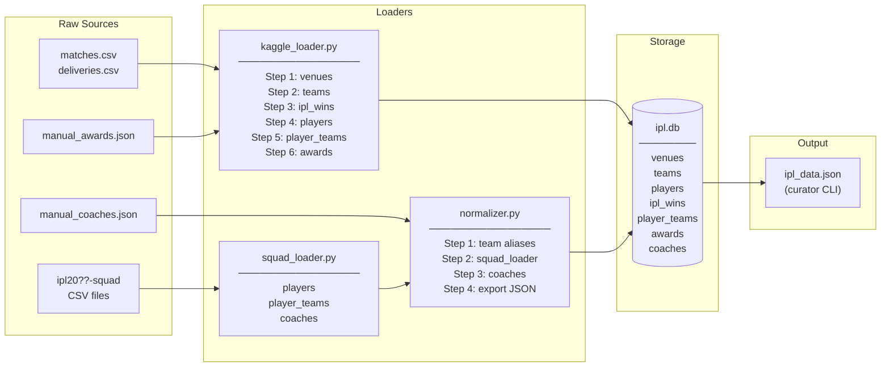

# IPL Data Pipeline

Loads IPL data from multiple sources into a SQLite database (`data/ipl.db`) and exports a flat JSON file (`data/ipl_data.json`) used by the puzzle curator.

---

## Prerequisites

```bash
cd packages/data-pipeline
pip install -r requirements.txt
```

Place the Kaggle dataset files in `data/`:
- `data/matches.csv`
- `data/deliveries.csv`

Download from: https://www.kaggle.com/datasets/patrickb1912/ipl-complete-dataset-20082020

---

## Data flow



---

## Data sources

| File | Description |
|------|-------------|
| `data/matches.csv` | Kaggle — match results 2008–2020 |
| `data/deliveries.csv` | Kaggle — ball-by-ball data 2008–2020 |
| `data/ipl20??-squad` | CSV squad lists per season (Team, Head Coach, Complete Squad List) |
| `data/manual_awards.json` | Official award winners (Orange Cap, Purple Cap, Player of Tournament, Costliest Player) |
| `data/manual_coaches.json` | Head coaches per team per season (2008–2025) |

---

## Full load (fresh start)

Run these commands in order:

```bash
cd packages/data-pipeline

# Step 1 — Load Kaggle CSV data (--reset drops and recreates all tables)
python kaggle_loader.py --data-dir data/ --db data/ipl.db --reset

# Step 2 — Normalise, load squads + coaches, export JSON
python normalizer.py --db data/ipl.db --export-json data/ipl_data.json
```

`kaggle_loader.py` loads in sequence:
1. Venues, teams, IPL season winners
2. Players and player-team links from match data
3. Awards from `manual_awards.json` (Orange Cap, Purple Cap, Player of Tournament, Costliest Player)

`normalizer.py` automatically runs in sequence:
1. Merges renamed franchise aliases (e.g. Delhi Daredevils → Delhi Capitals)
2. Loads all `ipl20??-squad` files via `squad_loader.py` (players, player-team links, head coaches)
3. Loads `manual_coaches.json` for historical coach records
4. Exports `data/ipl_data.json`

---

## Clearing the database

To wipe all data and start fresh, use the `--reset` flag with `kaggle_loader.py`:

```bash
python kaggle_loader.py --data-dir data/ --db data/ipl.db --reset
```

This drops and recreates all tables before loading.

To delete the database file entirely:

```bash
rm data/ipl.db
```

---

## Partial reload (no reset)

If you've updated a squad file or manual data file and want to reload without wiping:

```bash
# Re-run normalizer only (squads, coaches, JSON export)
python normalizer.py --db data/ipl.db --export-json data/ipl_data.json

# Or reload squads only
python squad_loader.py --data-dir data/ --db data/ipl.db
```

Note: `squad_loader.py` uses `INSERT OR IGNORE` for players/player_teams and `INSERT OR REPLACE` for coaches, so re-running is safe.

---

## Adding a new season's squad

1. Create `data/ipl20YY-squad` with this format:

```
Team,Head Coach,Complete Squad List
CSK,Stephen Fleming,"Ruturaj Gaikwad (C), MS Dhoni, ..."
MI,Mahela Jayawardene,"Hardik Pandya (C), Rohit Sharma, ..."
```

Supported team codes: `CSK`, `MI`, `RCB`, `KKR`, `DC`, `SRH`, `RR`, `LSG`, `GT`, `PBKS`

2. Re-run normalizer:

```bash
python normalizer.py --db data/ipl.db --export-json data/ipl_data.json
```

---

## Updating manual awards

Edit `data/manual_awards.json` and add the season entry under the relevant award type:

```json
{
  "orange_cap":          { "2025": "B Sai Sudharsan", ... },
  "purple_cap":          { "2025": "Prasidh Krishna", ... },
  "player_of_tournament":{ "2025": "...", ... },
  "costliest_player":    { "2025": "RR Pant", ... }
}
```

Player names must match the format in the database. For players loaded via squad files, use the full name (e.g. `Ruturaj Gaikwad`). For players from the Kaggle dataset, use scorecard initials (e.g. `RA Gaikwad`).

Then reload:

```bash
python kaggle_loader.py --data-dir data/ --db data/ipl.db --reset
python normalizer.py --db data/ipl.db --export-json data/ipl_data.json
```

---

## Output

| File | Description |
|------|-------------|
| `data/ipl.db` | SQLite database (source of truth) |
| `data/ipl_data.json` | Flat JSON export for the curator CLI |

### ipl_data.json structure

```json
{
  "teams":        [{ "id", "name", "short_name", "city" }],
  "players":      [{ "id", "name", "nicknames", "nationality" }],
  "player_teams": [{ "player_id", "player_name", "team_id", "team_name", "season" }],
  "awards":       [{ "type", "player_id", "player_name", "season" }],
  "ipl_wins":     [{ "season", "team_id", "team_name" }],
  "venues":       [{ "id", "name", "city" }],
  "coaches":      [{ "team_id", "team_name", "season", "coach" }]
}
```
