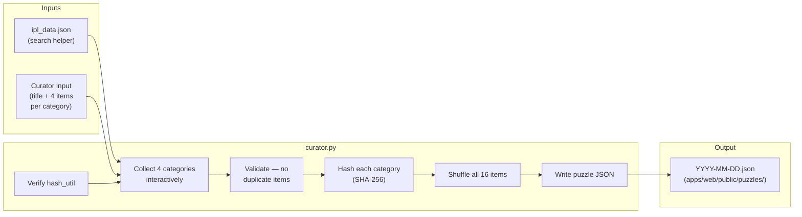

# Puzzle Curator

Interactive CLI to create and validate daily IPL Connections puzzle files.

---

## How it works



### Categories and difficulty

Each puzzle has exactly **4 categories**, one per colour, in order of difficulty:

| Colour | Difficulty | Example |
|--------|-----------|---------|
| Yellow | Easiest — obvious IPL groupings | "CSK Players" |
| Green | Moderate — requires IPL knowledge | "Purple Cap Winners" |
| Blue | Hard — nuanced facts / less-known trivia | "IPL Winning Captains (first time)" |
| Purple | Hardest — wordplay, puns, obscure connections | "Player Nicknames" |

Each category contains exactly **4 items**. All 16 items across the 4 categories must be unique.

### Answer hashing

Category answers are never stored in plaintext. Instead, `hash_util.py` computes a **SHA-256** hash of the 4 items (sorted case-insensitively, joined with `|`) and stores that hash in the puzzle JSON. The browser recomputes the hash when the player submits a guess and compares — no backend call needed.

The Python hash implementation must stay in sync with `apps/web/src/lib/hash.ts`. `curator.py` runs a self-check against known hashes on every `create` run to catch any drift.

### Puzzle JSON format

```json
{
  "id": "2026-03-20",
  "date": "2026-03-20",
  "edition": 2,
  "items": ["Item1", "Item2", "...16 items shuffled..."],
  "categories": [
    { "color": "yellow", "title": "Category Title", "hash": "<sha256>" },
    { "color": "green",  "title": "Category Title", "hash": "<sha256>" },
    { "color": "blue",   "title": "Category Title", "hash": "<sha256>" },
    { "color": "purple", "title": "Category Title", "hash": "<sha256>" }
  ]
}
```

---

## Prerequisites

```bash
cd packages/puzzle-curator
pip install -r requirements.txt
```

Optionally, generate `ipl_data.json` first to enable the in-prompt search helper:

```bash
cd packages/data-pipeline
python kaggle_loader.py --data-dir data/ --db data/ipl.db --reset
python normalizer.py --db data/ipl.db --export-json data/ipl_data.json
```

---

## Create a puzzle

```bash
cd packages/puzzle-curator

python curator.py create \
  --date 2026-03-20 \
  --output ../../apps/web/public/puzzles/ \
  --data-file ../data-pipeline/data/ipl_data.json
```

The CLI will prompt you for each category in order (yellow → green → blue → purple):

```
── YELLOW — Easiest (obvious IPL groupings) ──
  Category title for YELLOW: CSK Players
  Item 1/4 — Search (or press Enter to type directly): dhoni
  Matches:
    1. MS Dhoni
  Item 1/4 — Item name: MS Dhoni
  Added: MS Dhoni  (1/4)
  ...
```

On completion it writes `apps/web/public/puzzles/2026-03-20.json` and prints a full summary.

### Options

| Flag | Required | Description |
|------|----------|-------------|
| `--date YYYY-MM-DD` | Yes | Puzzle date — used as the filename and puzzle `id` |
| `--output DIR` | Yes | Directory to write the puzzle JSON into |
| `--data-file PATH` | No | Path to `ipl_data.json` to enable the search helper |
| `--edition N` | No | Override edition number (auto-detected from existing files if omitted) |

---

## Validate a puzzle

```bash
python curator.py validate --file ../../apps/web/public/puzzles/2026-03-20.json
```

Runs 7 checks:

1. JSON parses correctly
2. All required fields present (`id`, `date`, `edition`, `items`, `categories`)
3. Exactly 16 items
4. Exactly 4 categories, one per colour
5. No duplicate items
6. Each category hash is a valid 64-character hex string
7. Hash round-trip — brute-forces all C(16,4)=1820 combinations to confirm each stored hash matches its 4 items

---

## Auto-generate a puzzle

`auto_curator.py` picks items automatically from `ipl_data.json` based on category type specs,
checks for collisions with previously published puzzles, and writes the JSON after confirmation.

### Generate

```bash
cd packages/puzzle-curator

python auto_curator.py generate \
  --date 2026-03-20 \
  --output ../../apps/web/public/puzzles/ \
  --data-file ../data-pipeline/data/ipl_data.json \
  --categories yellow:orange_cap green:purple_cap blue:ipl_champions purple:team_players:CSK:2025
```

Pass exactly **4** `--categories` specs, one per colour, in `color:type[:params]` format:

| Category type | Params | Items drawn from |
|---------------|--------|-----------------|
| `orange_cap` | — | Orange Cap winners |
| `purple_cap` | — | Purple Cap winners |
| `player_of_tournament` | — | Player of the Tournament winners |
| `costliest_player` | — | Costliest auction picks |
| `winning_captain` | — | IPL winning captains |
| `ipl_champions` | — | Unique IPL-winning team names |
| `team_players` | `TEAM:SEASON` | Squad players for a team + season |
| `coaches` | `SEASON` | Head coaches for a season |

**Team codes:** `CSK`, `MI`, `RCB`, `KKR`, `DC`, `SRH`, `RR`, `LSG`, `GT`, `PBKS`

Items that appear in any previously published puzzle are automatically excluded. If fewer than
4 candidates remain after exclusions the generator prints a clear error.

The tool shows a full preview and prompts `Save this puzzle? [y/N]` before writing anything.
After saving, validate with:

```bash
python curator.py validate --file ../../apps/web/public/puzzles/2026-03-20.json
```

### Check for cross-puzzle collisions

```bash
python auto_curator.py check \
  --file ../../apps/web/public/puzzles/2026-03-20.json \
  --puzzles-dir ../../apps/web/public/puzzles/
```

Scans every `YYYY-MM-DD.json` in the directory and reports any item in the target puzzle that
has already appeared in another puzzle. Exits 0 if clean, 1 if collisions found.

---

## Verify hash compatibility

To confirm the Python hash output matches the browser's Web Crypto implementation:

```bash
python hash_util.py
# PASS
```
