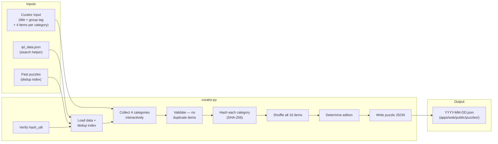
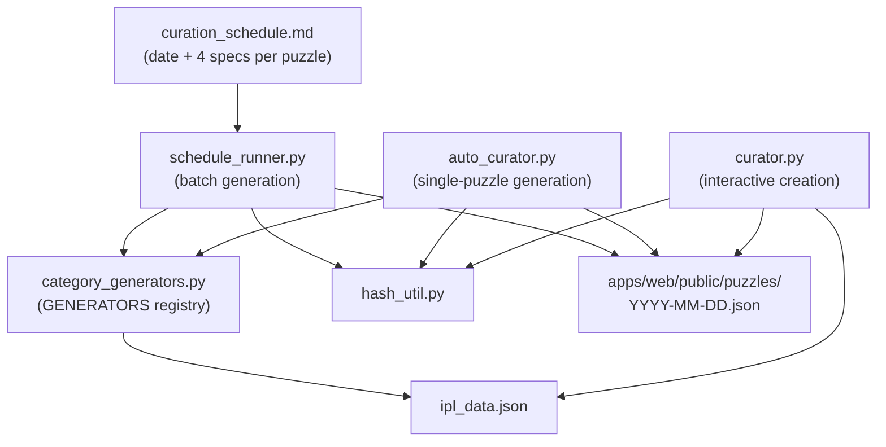

# Puzzle Curator

Interactive CLI to create and validate daily IPL Connections puzzle files.

---

## How it works



### Categories and difficulty

Each puzzle has exactly **4 categories**, one per colour, in order of difficulty:

| Colour | Difficulty | Example |
|--------|-----------|---------|
| Yellow | Easiest — obvious IPL groupings | "CSK Players" |
| Green | Moderate — requires IPL knowledge | "Purple Cap Winners" |
| Blue | Hard — nuanced facts / less-known trivia | "IPL Winning Captains (first time)" |
| Purple | Hardest — wordplay, puns, obscure connections | "Player Nicknames" |

Each category contains exactly **4 items**. All 16 items across the 4 categories must be unique.

### Answer hashing

Category answers are never stored in plaintext. Instead, `hash_util.py` computes a **SHA-256** hash of the 4 items (sorted case-insensitively, joined with `|`) and stores that hash in the puzzle JSON. The browser recomputes the hash when the player submits a guess and compares — no backend call needed.

The Python hash implementation must stay in sync with `apps/web/src/lib/hash.ts`. `curator.py` runs a self-check against known hashes on every `create` run to catch any drift.

### Puzzle JSON format

```json
{
  "id": "2026-03-20",
  "date": "2026-03-20",
  "edition": 2,
  "items": ["Item1", "Item2", "...16 items shuffled..."],
  "categories": [
    {
      "color": "yellow", "title": "Category Title", "hash": "<sha256>",
      "group": "team_players:CSK:2026",
      "items": ["MS Dhoni", "R Jadeja", "R Gaikwad", "D Conway"]
    },
    { "color": "green",  "title": "...", "hash": "<sha256>", "group": "orange_cap",  "items": [...] },
    { "color": "blue",   "title": "...", "hash": "<sha256>", "group": "coaches:2026", "items": [...] },
    { "color": "purple", "title": "...", "hash": "<sha256>", "items": [...] }
  ]
}
```

`group` and `items` per category are curator metadata used for cross-puzzle deduplication. The game UI only uses `hash`. Both fields are optional — legacy puzzles without them remain valid.

---

## Architecture

Five files make up the puzzle curator system:

```
puzzle-curator/
├── curator.py            # Interactive CLI — create/validate puzzles manually
├── auto_curator.py       # Non-interactive CLI — generate + check puzzles from specs
├── category_generators.py# Generator registry — picks 4 items per category type
├── schedule_runner.py    # Batch runner — reads curation_schedule.md, calls generators
├── hash_util.py          # SHA-256 answer hashing (must stay in sync with browser)
└── curation_schedule.md  # Season plan — date, generator specs, match pairings, status
```



**Typical workflows:**

| Task | Tool |
|---|---|
| Generate all pending puzzles for a season | `schedule_runner.py` |
| Generate one puzzle for a specific date | `schedule_runner.py --date YYYY-MM-DD` |
| Generate a single puzzle with custom specs | `auto_curator.py generate` |
| Build a puzzle interactively (browsing data) | `curator.py create` |
| Validate an existing puzzle file | `curator.py validate` |
| Check cross-puzzle item collisions | `auto_curator.py check` |

---

## Prerequisites

```bash
cd packages/puzzle-curator
pip install -r requirements.txt
```

Optionally, generate `ipl_data.json` first to enable the in-prompt search helper:

```bash
cd packages/data-pipeline
python kaggle_loader.py --data-dir data/ --db data/ipl.db --reset
python normalizer.py --db data/ipl.db --export-json data/ipl_data.json
```

---

## Create a puzzle

```bash
cd packages/puzzle-curator

python curator.py create \
  --date 2026-03-20 \
  --output ../../apps/web/public/puzzles/ \
  --data-file ../data-pipeline/data/ipl_data.json
```

The CLI will prompt you for each category in order (yellow → green → blue → purple):

```
── YELLOW — Easiest (obvious IPL groupings) ──
  Category title for YELLOW: CSK 2026 Squad
  Group tag identifies the data source for dedup (e.g. topbat / state:Karnataka / team_players:CSK:2026).
  Groups used so far: orange_cap, team_players:RCB:2026
  Group tag for YELLOW (Enter to skip): team_players:CSK:2026

  Enter 4 items for YELLOW:
  Item 1/4 — Search / browse (? for shortcuts, Enter to skip): ?team:CSK:2026
    CSK 2026 squad (25 players):
      ...
  Item 1/4 — Search / browse (? for shortcuts, Enter to skip): dhoni
  Matches:
    1. MS Dhoni
  Item 1/4 — Item name: MS Dhoni
  Added: MS Dhoni  (1/4)
  ...
```

### Browse shortcuts

Type `?` at the search prompt to list all shortcuts. Key shortcuts:

| Shortcut | Shows |
|---|---|
| `?team` | All teams with season ranges |
| `?team:RCB` | All seasons for RCB with player counts |
| `?team:RCB:2026` | Full RCB 2026 squad |
| `?coaches:2026` | Head coaches for 2026 |
| `?batting_coaches:2026` | Batting coaches for 2026 |
| `?bowling_coaches:2026` | Bowling coaches for 2026 |
| `?fielding_coaches:2026` | Fielding coaches for 2026 |
| `?orange_cap` | All Orange Cap winners by season |
| `?purple_cap` | All Purple Cap winners by season |
| `?pot` | Player of Tournament winners |
| `?costliest` | Costliest auction picks |
| `?winning_captain` | IPL winning captains |
| `?ipl_champions` | IPL championship teams by season |
| `?batting_records` | Career batting record holders |
| `?bowling_records` | Career bowling record holders |
| `?season_records` | Single-season record holders |
| `?fielding_records` | Fielding record holders |
| `?team_owners` | Franchise owners |
| `?countries` | Foreign players by country |
| `?states` | Indian players by home state |
| `?ranji` | Indian players by Ranji team |
| `?topbat` | Top run-scorers |
| `?topbowl` | Top wicket-takers |
| `?fifers` | Players with 5-wicket hauls |
| `?multiteam` | Players with most franchises |
| `?ducks` | Players with most ducks |

On completion it writes `apps/web/public/puzzles/2026-03-20.json` and prints a full summary.

### Options

| Flag | Required | Description |
|------|----------|-------------|
| `--date YYYY-MM-DD` | Yes | Puzzle date — used as the filename and puzzle `id` |
| `--output DIR` | Yes | Directory to write the puzzle JSON into |
| `--data-file PATH` | No | Path to `ipl_data.json` to enable the search helper |
| `--edition N` | No | Override edition number (auto-detected from existing files if omitted) |

---

## Validate a puzzle

```bash
python curator.py validate --file ../../apps/web/public/puzzles/2026-03-20.json
```

Runs 7 checks:

1. JSON parses correctly
2. All required fields present (`id`, `date`, `edition`, `items`, `categories`)
3. Exactly 16 items
4. Exactly 4 categories, one per colour
5. No duplicate items
6. Each category hash is a valid 64-character hex string
7. Hash round-trip — brute-forces all C(16,4)=1820 combinations to confirm each stored hash matches its 4 items

---

## Auto-generate a puzzle

`auto_curator.py` picks items automatically from `ipl_data.json` based on category type specs,
checks for collisions with previously published puzzles, and writes the JSON after confirmation.

### Generate

```bash
cd packages/puzzle-curator

python auto_curator.py generate \
  --date 2026-03-20 \
  --output ../../apps/web/public/puzzles/ \
  --data-file ../data-pipeline/data/ipl_data.json \
  --categories yellow:orange_cap green:purple_cap blue:ipl_champions purple:team_players:CSK:2025
```

Pass exactly **4** `--categories` specs, one per colour, in `color:type[:params]` format:

| Category type | Params | Items drawn from |
|---------------|--------|-----------------|
| `orange_cap` | — | Orange Cap winners |
| `purple_cap` | — | Purple Cap winners |
| `player_of_tournament` | — | Player of the Tournament winners |
| `costliest_player` | — | Costliest auction picks |
| `winning_captain` | — | IPL winning captains |
| `ipl_champions` | — | Unique IPL-winning team names |
| `team_players` | `TEAM:SEASON` | Squad players for a team + season |
| `coaches` | `SEASON` | Head coaches for a season |
| `batting_coaches` | `SEASON` | Batting coaches for a season |
| `bowling_coaches` | `SEASON` | Bowling coaches for a season |
| `fielding_coaches` | `SEASON` | Fielding coaches for a season |
| `batting_records` | — | Career batting record holders |
| `bowling_records` | — | Career bowling record holders |
| `season_records` | — | Single-season record holders |
| `fielding_records` | — | Fielding record holders (pool of 4 — use once) |
| `team_owners` | — | IPL franchise owners |

**Team codes:** `CSK`, `MI`, `RCB`, `KKR`, `DC`, `SRH`, `RR`, `LSG`, `GT`, `PBKS`, `RR`, `PWI`, `RPS`, `GL`, `DD`

Items that appear in any previously published puzzle are automatically excluded. If fewer than
4 candidates remain after exclusions the generator prints a clear error.

The tool shows a full preview and prompts `Save this puzzle? [y/N]` before writing anything.
After saving, validate with:

```bash
python curator.py validate --file ../../apps/web/public/puzzles/2026-03-20.json
```

### Check for cross-puzzle collisions

```bash
python auto_curator.py check \
  --file ../../apps/web/public/puzzles/2026-03-20.json \
  --puzzles-dir ../../apps/web/public/puzzles/
```

Scans every `YYYY-MM-DD.json` in the directory and reports any item in the target puzzle that
has already appeared in another puzzle. Exits 0 if clean, 1 if collisions found.

---

## Category generators

`category_generators.py` defines the **GENERATORS registry** — a dict mapping type names to functions. Every generator has the same signature:

```python
def gen_example(ipl_data: dict, params: list[str], exclude: set[str]) -> dict:
    # ipl_data  — full ipl_data.json loaded as a dict
    # params    — list of extra tokens parsed from the spec (e.g. ["CSK", "2025"])
    # exclude   — set of item names already used (must not be returned)
    return {"title": "Category Title", "items": ["A", "B", "C", "D"]}
```

The shared helper `_pick(candidates, exclude, label)` deduplicates the candidate list, removes items in `exclude`, then picks exactly 4 at random. It raises `ValueError` if fewer than 4 candidates remain.

### Spec format

Generator specs use a colon-delimited format: `type[:param1[:param2...]]`

```
orange_cap               → no params
coaches:2026             → one param: season
team_players:CSK:2025    → two params: team code + season
```

The entry point `generate_category(ipl_data, spec, exclude)` splits the spec, looks up the generator in `GENERATORS`, and calls it.

### Adding a new generator

1. Write a function `gen_my_type(ipl_data, params, exclude) -> dict` in `category_generators.py`
2. Register it: `GENERATORS["my_type"] = gen_my_type`
3. Add the data it needs to `ipl_data.json` (via `normalizer.py` export) or use an existing key
4. Add a browse shortcut in `curator.py`'s `browse_groups()` so the interactive curator can display it
5. Add a row to the generator types table in `curation_schedule.md`

---

## Schedule-based batch generation

`schedule_runner.py` reads `curation_schedule.md`, finds rows whose specs are filled in and status is not `[x]`, calls the generators, and writes puzzle JSON files.

### curation_schedule.md format

The schedule is a Markdown table. Each data row represents one puzzle:

```
| Ed | Date   | Day | Match(es)        | 🟨 Yellow             | 🟩 Green              | 🟦 Blue        | 🟪 Purple            | Status |
|---|---|---|---|---|---|---|---|---|
| 6  | 28 Mar | Sat | M1: RCB vs SRH   | `team_players:RCB:2026` | `team_players:SRH:2026` | `batting_records` | `player_of_tournament` | [ ]  |
```

- **Ed** — edition number (integer)
- **Date** — `DD Mon` or `DD Mon YYYY` (year defaults to 2026 if omitted)
- **Status** — `[ ]` pending, `[~]` draft ready, `[x]` published
- **Spec columns** — the 4 columns before Status, one per colour. Use `—` or `tbd` to mark not-yet-assigned specs; the runner skips those rows.

### schedule_runner.py usage

```bash
cd packages/puzzle-curator

# Dry run — preview all pending puzzles without writing files
python schedule_runner.py --dry-run

# Generate all pending puzzles (status [ ] with specs filled)
python schedule_runner.py

# Generate a single date
python schedule_runner.py --date 2026-03-28

# Generate a date range
python schedule_runner.py --from 2026-03-23 --to 2026-03-27

# Overwrite existing files
python schedule_runner.py --force
```

| Flag | Default | Description |
|---|---|---|
| `--schedule PATH` | `./curation_schedule.md` | Path to the schedule Markdown file |
| `--data-file PATH` | `../data-pipeline/data/ipl_data.json` | Path to ipl_data.json |
| `--output DIR` | `../../apps/web/public/puzzles/ipl` | Puzzle output directory |
| `--dry-run` | — | Preview without writing files |
| `--force` | — | Overwrite existing puzzle files |
| `--date YYYY-MM-DD` | — | Generate only this date |
| `--from YYYY-MM-DD` | — | Start of date range (inclusive) |
| `--to YYYY-MM-DD` | — | End of date range (inclusive) |

The runner automatically avoids re-using items across puzzles within the same run (a running `exclude` set is passed into each generator call, accumulating items from puzzles already generated in that session).

---

## Cross-puzzle deduplication

### Rule engine

`curator.py` enforces five rules when building a puzzle interactively. Rules fire at two points: when the curator types a **group tag**, and when the curator types an **item name**.

| Rule | Fires at | Default | Severity | Description |
|---|---|---|---|---|
| `group_cooldown` | group tag | 4 days | warn | Same group tag not within 4 days |
| `type_cooldown` | group tag | 3 days | warn | Same category-type prefix not within 3 days (e.g. two `coaches:*` entries) |
| `team_cooldown` | group tag | 2 days | warn | Same franchise team not within 2 days (applies to `team_players:TEAM:*`) |
| `item_cooldown` | item | 2 days | warn | Same player/item in any puzzle within 2 days |
| `group_item_used` | item | permanent | **block** | `(group, item)` pair already used on any past date — never repeats |

**Warn** rules ask "Add anyway? [y/N]" before blocking. **Block** rules are hard stops — the item cannot be added.

Cooldown constants (`ITEM_COOLDOWN_DAYS`, `GROUP_COOLDOWN_DAYS`, etc.) are defined at the top of `curator.py` and can be adjusted without touching the rule logic.

### Group tags

Each category carries an optional **group tag** — a string identifying the data source (e.g. `team_players:CSK:2026`, `orange_cap`, `state:Karnataka`). The rule engine derives the type prefix and team code automatically:

| Group tag | Type prefix | Team code |
|---|---|---|
| `team_players:CSK:2026` | `team_players` | `CSK` |
| `coaches:2026` | `coaches` | — |
| `orange_cap` | `orange_cap` | — |
| `state:Karnataka` | `state` | — |

This means the same player **can** appear in different groups on different days (`MS Dhoni` in `team_players:CSK:2026` and later in `orange_cap` are different group-item pairs — both allowed), but:
- `MS Dhoni` in `team_players:CSK:2026` will block if that exact group is used again (permanent)
- Any player who appeared yesterday will trigger a 2-day item cooldown warn

### Dedup index

`load_used_items(output_dir)` scans all `YYYY-MM-DD.json` files and builds a `DedupeIndex` with five lookup tables:

| Table | Key | Value |
|---|---|---|
| `used_items` | `(group, item)` | first date used |
| `group_dates` | group tag | latest date used |
| `item_dates` | item name | latest date used (any group) |
| `type_dates` | type prefix | latest date used |
| `team_dates` | team code | latest date used |

### Example session output

```
Group tag for YELLOW (Enter to skip): team_players:CSK:2026
  [WARN]  Group 'team_players:CSK:2026' was last used on 2026-03-24 (2 day(s) ago — min gap is 4 days).
  [WARN]  Category type 'team_players' was last used on 2026-03-25 (1 day(s) ago — min gap is 3 days).
  Add anyway? [y/N]: n
  Enter a different group tag.

Item 1/4 — Item name: MS Dhoni
  [BLOCK] 'MS Dhoni' was already used in group 'team_players:CSK:2026' on 2026-03-24.
  This item cannot be added (hard block). Choose a different item.
```

Omitting the group tag (Enter to skip) disables all dedup checks for that category — items are still valid but won't be tracked in future runs.

### In schedule_runner.py (batch)

The batch runner uses a simpler global `exclude` set (all items from existing puzzles) passed directly to the generators. Generators call `_pick(candidates, exclude, label)` which filters out already-used items before sampling. The full rule engine does not apply to batch generation — it is enforced only in the interactive curator.

---

## Verify hash compatibility

To confirm the Python hash output matches the browser's Web Crypto implementation:

```bash
python hash_util.py
# PASS
```
